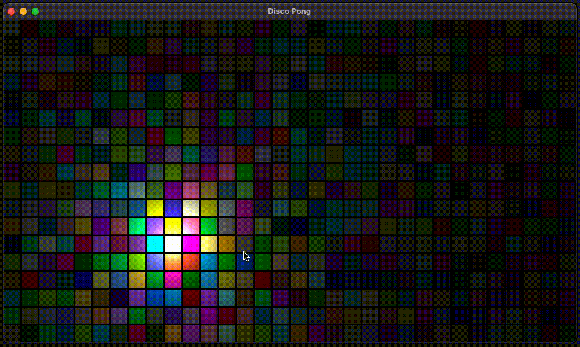

# Disco Pong

## Demo

This is what I've built so far with what I've learned about OpenGL and graphics programming



## Building

Command-line:

```sh
$ ./configure.sh
$ ./build.sh
```

## Running

Command-line:

```sh
$ ./out/build/DiscoPong
```
